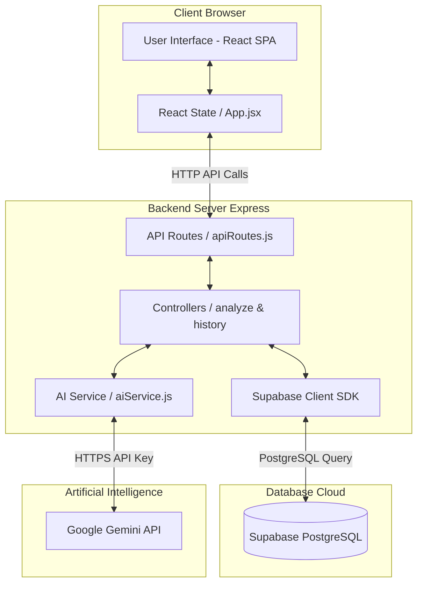
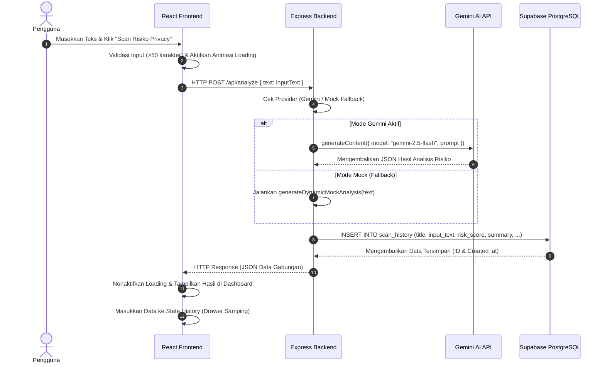

# LAPORAN IMPLEMENTASI & EVALUASI SISTEM
## PRIVACY POLICY RISK SCANNER — SISTEM DETEKSI RISIKO DOKUMEN HUKUM PRIVASI BERBASIS KECERDASAN BUATAN
**Tugas Besar Mata Kuliah Kapita Selekta — UAS Kelompok 6**

---

## 1. Pendahuluan

### Ringkasan Latar Belakang Proyek
Di era interkonektivitas digital saat ini, hampir setiap layanan internet mewajibkan pengguna untuk menyetujui dokumen Kebijakan Privasi (*Privacy Policy*) sebelum menggunakan layanannya. Dokumen ini secara legal menjelaskan bagaimana data pribadi pengguna dikumpulkan, diproses, dibagikan, dan disimpan. Namun, pada kenyataannya, dokumen kebijakan privasi sering kali ditulis dalam bahasa hukum yang rumit (*legalese*), sangat panjang (bisa mencapai ribuan kata), dan sengaja disusun secara tidak transparan untuk menyembunyikan klausul-klausul berisiko tinggi. 

Di Indonesia, disahkannya **Undang-Undang Perlindungan Data Pribadi (UU PDP)** menuntut transparansi penuh dari pengendali data pribadi. Kendati demikian, sebagian besar pengguna awam tidak memiliki waktu, keahlian hukum, maupun ketekunan untuk membaca dan menganalisis dokumen tersebut baris-demi-baris sebelum mencentang kotak persetujuan. Ketimpangan informasi ini sering kali berujung pada eksploitasi data pribadi, pelacakan lokasi tanpa izin, atau penjualan profil digital kepada pihak ketiga. Oleh karena itu, diperlukan sebuah alat bantu berbasis teknologi kecerdasan buatan (*Artificial Intelligence*) yang mampu menyaring dan menerjemahkan klausul berisiko di dalam dokumen kebijakan privasi secara instan ke dalam bahasa Indonesia yang mudah dipahami orang awam.

### Ringkasan Solusi yang Dikembangkan
**Privacy Policy Risk Scanner** adalah aplikasi web modern yang dirancang untuk mendeteksi potensi risiko privasi bagi pengguna secara instan dari dokumen kebijakan privasi. Pengguna cukup menyalin dan menempelkan teks kebijakan privasi, atau memilih sampel kebijakan yang telah disediakan. Solusi utama yang ditawarkan oleh sistem ini meliputi:
*   **Deteksi Tingkat Risiko Dinamis**: Mengklasifikasikan tingkat risiko keseluruhan dokumen ke dalam empat kategori (*Danger*, *High*, *Medium*, *Low*) yang disertai visualisasi warna yang tegas.
*   **Analisis AI Komprehensif**: Mengekstrak ringkasan dokumen privasi dalam bahasa sederhana (bahasa awam), mendaftar rekomendasi tindakan konkret bagi pengguna, serta mengidentifikasi kutipan klausul berisiko spesifik lengkap dengan penjelasan dampaknya.
*   **Sistem Riwayat Sinkron**: Drawer riwayat pindaian samping yang tersinkronisasi secara real-time dengan database PostgreSQL cloud Supabase.
*   **Fallback Cerdas (Mock Mode)**: Algoritma pencocokan kata kunci lokal yang bertindak sebagai cadangan dinamis apabila API Key Gemini mengalami gangguan kuota atau kendala jaringan, menjaga agar sistem tetap dapat diakses tanpa *crash*.

### Tujuan Implementasi
Tujuan utama implementasi pada tahap ini adalah:
1.  Merealisasikan desain konseptual Privacy Policy Risk Scanner menjadi prototipe aplikasi Single Page Application (SPA) yang interaktif, responsif, dan siap guna.
2.  Membangun arsitektur backend berbasis Express (Node.js) yang teratur dan modular untuk memproses request, memanggil pustaka AI, dan menjembatani komunikasi ke database.
3.  Mengintegrasikan database relasional PostgreSQL cloud melalui **Supabase** sebagai media penyimpanan riwayat pemindaian permanen.
4.  Mengintegrasikan model kecerdasan buatan **Google Gemini AI** (`gemini-2.5-flash`) untuk melakukan ekstraksi parameter risiko dan pembuatan ringkasan bahasa alami secara cerdas dan akurat.

### Ruang Lingkup Implementasi
Ruang lingkup sistem Privacy Policy Risk Scanner pada iterasi ini meliputi:
*   **Pemindaian Teks**: Mendukung masukan teks bebas dengan panjang minimal 50 karakter untuk menghindari pemindaian dokumen kosong atau tidak sah.
*   **Dashboard Visual**: Halaman keluaran hasil scan yang menyajikan ringkasan eksekutif, filter risiko untuk memilah klausul berbahaya, akordeon detail hukum, dan kartu skor utama.
*   **Manajemen Riwayat CRUD**: Pengambilan 10 riwayat scan terbaru secara menurun, penghapusan baris riwayat tertentu secara asinkron, serta pembersihan seluruh data riwayat dari database.
*   **Fungsi Utilitas Ekspor**: Tombol pintas untuk menyalin laporan terformat ke clipboard dan tombol untuk mengunduh laporan utuh sebagai berkas `.txt` lokal.
*   **Responsivitas Visual & Tema**: Antarmuka responsif ramah mobile, dilengkapi dengan fitur penggantian tema mode gelap (*dark-mode*) dan terang (*light-mode*) dengan transisi animasi CSS yang halus.

---

## 2. Arsitektur Implementasi

### Arsitektur Implementasi Aktual
Sistem Privacy Policy Risk Scanner dibangun menggunakan arsitektur **Client-Server (Three-Tier Architecture)** yang terdiri dari lapisan Frontend, Backend API, Database, dan AI Service API Pihak Ketiga. 



### Komponen Frontend
Komponen frontend dibangun menggunakan pustaka **React.js** dengan bundler **Vite** dan engine gaya **Tailwind CSS v4**. Struktur komponen dipecah menjadi beberapa modul reusable:
*   `App.jsx`: Mengelola state utama aplikasi (seperti teks masukan, status loading, hasil analisis aktif, dan array riwayat) serta merakit komponen UI menjadi tata letak yang utuh.
*   `PolicyInput.jsx`: Form masukan berupa textarea panjang dilengkapi tombol pembersihan input serta tombol untuk memuat sampel kebijakan instan.
*   `ScanDashboard.jsx`: Menampilkan kartu skor risiko keseluruhan, ringkasan bahasa awam, rekomendasi tindakan, serta visualisasi list klausul bermasalah dengan komponen akordeon (*accordion*).
*   `HistoryDrawer.jsx`: Panel samping meluncur (*slide-out sidebar*) yang menyajikan daftar riwayat scan pengguna dari database Supabase.
*   `CustomModal.jsx`: Pengganti fungsi dialog bawaan browser (`alert`/`confirm`) yang bergaya modern dan otomatis mengikuti skema warna tema aktif.

### Komponen Backend/API
Komponen backend dikembangkan menggunakan kerangka kerja **Express** (Node.js) dengan format ES Module. Fungsionalitas dipisahkan menjadi rute, pengontrol (*controllers*), dan layanan (*services*):
*   `server.js`: Titik masuk utama aplikasi backend. Mengatur middleware Express, penanganan Cross-Origin Resource Sharing (CORS) agar frontend dapat mengakses server dari origin berbeda, dan mendaftarkan router API.
*   `routes/apiRoutes.js`: Mendefinisikan endpoint API (`/analyze`, `/history`, `/history/:id`) dan meneruskan request ke controller terkait.
*   `controllers/analyzeController.js`: Memproses input dari klien, memicu fungsi analisis AI, dan menyimpan hasilnya ke database Supabase sebelum dikirim kembali ke frontend.
*   `controllers/historyController.js`: Menangani logika CRUD untuk riwayat pindaian (membaca daftar riwayat, menghapus satu riwayat berdasarkan parameter ID, dan menghapus seluruh tabel riwayat).

### Database
Penyimpanan data persisten menggunakan database relasional **PostgreSQL** yang dikelola di cloud oleh **Supabase**. Koneksi backend dengan database dilakukan menggunakan client SDK `@supabase/supabase-js`.
*   Tabel `scan_history`: Menyimpan berkas riwayat pindaian. Struktur skema tabel didefinisikan sebagai berikut:
    *   `id`: `uuid` (Primary Key, di-generate otomatis oleh Supabase)
    *   `created_at`: `timestamptz` (Default: `now()`)
    *   `title`: `text` (Judul dokumen kebijakan privasi)
    *   `input_text`: `text` (Teks asli kebijakan privasi yang dipindai)
    *   `risk_score`: `text` (Skor risiko: Low / Medium / High / Danger)
    *   `summary`: `text` (Ringkasan eksekutif bahasa awam)
    *   `flagged_clauses`: `jsonb` (Array objek klausul berisiko: teks asli, alasan risiko, dan tingkat keparahan)
    *   `recommendations`: `jsonb` (Array teks rekomendasi tindakan)

### AI/Model Layer
Lapisan AI dipusatkan pada file `services/aiService.js` yang memanfaatkan SDK resmi Google Generative AI (`@google/generative-ai`) untuk terhubung ke model **Gemini 2.5 Flash** (`gemini-2.5-flash`). Model ini dipilih karena memiliki kecepatan inferensi yang sangat tinggi dan jendela konteks (*context window*) yang luas untuk menampung teks kebijakan privasi yang sangat panjang. Prompt dirancang secara ketat menggunakan instruksi *system-level* untuk memaksa model membalas hanya berupa teks JSON terformat agar mempermudah proses parsing di sisi server.

### Alur Data Sistem (Sequence Diagram)
Diagram sekuens berikut menggambarkan interaksi data dari input pengguna hingga penyimpanan database dan respon balik sistem:



---

## 3. Implementasi Sistem

### Teknologi yang Digunakan
Sistem dikembangkan menggunakan tumpukan teknologi modern:
*   **Frontend**:
    *   **React.js (v19.2.6)**: Library utama antarmuka pengguna berbasis komponen deklaratif.
    *   **Vite (v8.0.12)**: Bundler modern berkecepatan tinggi untuk siklus pengembangan yang efisien.
    *   **Tailwind CSS (v4.3.0)**: Framework CSS utilitas baru untuk penataan gaya visual tanpa menulis file CSS panjang terpisah.
    *   **Lucide React (v1.17.0)**: Pustaka ikon minimalis berformat SVG.
*   **Backend**:
    *   **Node.js (v20+)** dan **Express (v4.19.2)**: Lingkungan server dan kerangka kerja API HTTP.
    *   **CORS (v2.8.5)**: Mengaktifkan izin akses lintas domain.
    *   **Dotenv (v16.4.5)**: Memuat file konfigurasi `.env` secara aman.
    *   **@google/generative-ai (v0.14.0)**: SDK resmi Google Gemini AI.
    *   **@supabase/supabase-js (v2.108.1)**: Klien untuk operasi query ke Supabase Cloud.

### Struktur Folder Project
Bagan struktur folder repositori modular ini tersusun sebagai berikut:

```
Tubes Kapita 06/
├── backend/                  # Kode Sumber Server Express
│   ├── controllers/
│   │   ├── analyzeController.js  # Mengontrol pemrosesan scan & penyimpanan DB
│   │   └── historyController.js  # Mengontrol CRUD riwayat scan di Supabase
│   ├── routes/
│   │   └── apiRoutes.js          # Router API HTTP Express
│   ├── services/
│   │   ├── aiService.js          # Layanan Gemini AI & Mock Fallback Logic
│   │   └── supabaseClient.js      # Inisialisasi client DB Supabase
│   ├── .env                      # Kredensial rahasia (Gemini & Supabase)
│   ├── .env.example              # Panduan kredensial pengembang
│   ├── package.json              # Dependensi server & script start/dev
│   └── server.js                 # Entrypoint server backend
├── frontend/                 # Kode Sumber Klien React (Vite)
│   ├── public/                   # Aset publik statis
│   ├── src/
│   │   ├── components/           # Komponen UI Reusable
│   │   │   ├── CustomModal.jsx   # Dialog modal kustom untuk alert/confirm
│   │   │   ├── HistoryDrawer.jsx # Panel samping daftar riwayat scan
│   │   │   ├── PolicyInput.jsx   # Form area input teks kebijakan privasi
│   │   │   └── ScanDashboard.jsx # Dashboard hasil visualisasi scan risiko
│   │   ├── data/
│   │   │   └── samplePolicies.js # Konstanta sampel teks kebijakan privasi
│   │   ├── utils/
│   │   │   └── helpers.jsx       # Fungsi pemformatan tanggal & visual helper
│   │   ├── App.jsx               # Orkestrator state & layout utama
│   │   ├── index.css             # Konfigurasi Tailwind & token desain CSS
│   │   └── main.jsx              # Entrypoint React DOM
│   ├── package.json              # Dependensi frontend & script dev/build
│   └── vite.config.js            # Konfigurasi Vite & Tailwind CSS Plugin
├── docs/                     # Dokumentasi Alur & Struktur Folder
│   ├── alur_aplikasi.md
│   └── struktur_folder.md
├── Dokumentasi/              # Laporan & Berkas Hasil Pengujian (Tugas 4)
│   ├── LAPORAN.md                # Berkas Laporan UAS (Berkas ini)
│   ├── testing_report.md         # Hasil pengujian fungsional & performa
│   ├── walkthrough.md            # Panduan alur kode detail
│   ├── implementation_plan.md    # Rencana kerja pengembangan
│   └── task.md                   # Checklist tugas (Todo List)
└── Tugas4_Rubrik_Detail.docx  # Panduan tugas asli dari dosen
```

### Implementasi Frontend
Gaya visual antarmuka dikonfigurasi melalui file `frontend/src/index.css` menggunakan Tailwind CSS v4. Fokus utama diimplementasikan pada **Rich Visual Aesthetics** yang memberikan kesan premium bagi pengguna:
1.  **Dark Mode First & Custom Variables**:
    ```css
    :root {
      --color-brand-bg: #f8fafc;
      --color-brand-text: #0f172a;
      --color-brand-muted: #64748b;
      --color-brand-panel: #ffffff;
      --color-brand-border: #e2e8f0;
      /* ... */
    }
    .dark {
      --color-brand-bg: #030712;
      --color-brand-text: #f9fafb;
      --color-brand-muted: #9ca3af;
      --color-brand-panel: #0b0f19;
      --color-brand-border: #1f2937;
      /* ... */
    }
    ```
2.  **Efek Glassmorphism**:
    Kelas `.glass-panel` diimplementasikan dengan latar belakang semi-transparan, efek filter blur di latar belakang, dan bayangan lembut agar elemen tampak melayang premium.
3.  **Animasi Progresif**:
    Saat pemindaian berlangsung, `App.jsx` mengaktifkan state `loading` dan mensimulasikan perubahan teks progres (`loadingSteps`) secara bertahap melalui interval waktu 1,8 detik. Langkah ini memandu mata pengguna dan mengedukasi mereka tentang langkah-langkah yang sedang dikerjakan sistem di latar belakang.

### Implementasi Backend
Backend menggunakan pola **Express MVC (Model-View-Controller)** sederhana namun bersih.
*   **Keamanan Upload**: File `server.js` membatasi ukuran muatan request JSON hingga maksimal 2 Megabytes (`express.json({ limit: '2mb' })`) demi mengantisipasi celah eksploitasi serangan *Denial of Service (DoS)* menggunakan input teks super raksasa.
*   **Penetapan Judul Kebijakan**: Fungsi `getPolicyTitle(text)` di `analyzeController.js` mengekstrak baris pertama teks kebijakan sebagai judul (jika panjangnya valid antara 5-50 karakter). Jika baris pertama tidak memenuhi syarat, backend secara cerdas menetapkan judul berdasarkan tanggal dan waktu pemindaian aktif (misalnya: *Kebijakan Privasi (14 Juni 2026, 20.00)*).

### Implementasi Database
Database didesain sederhana namun efisien menggunakan tipe data terstruktur. Penggunaan kolom bertipe `jsonb` untuk `flagged_clauses` dan `recommendations` memberikan fleksibilitas tinggi. Tipe `jsonb` memungkinkan penyimpanan array objek dinamis hasil keluaran AI (yang jumlah itemnya bisa bervariasi bergantung pada isi dokumen kebijakan) ke dalam satu baris data tanpa perlu membuat tabel relasional terpisah yang rumit, sehingga mempercepat operasi I/O database.

### Integrasi AI
Integrasi AI diatur dalam `services/aiService.js`. Untuk memastikan respon berupa format JSON murni, prompt menginstruksikan format keluaran secara eksplisit, dan parameter `responseMimeType: "application/json"` dilewatkan ke `generationConfig` SDK Gemini. Dengan demikian, model secara otomatis merender data dalam kerangka JSON valid yang siap di-parsing menggunakan metode bawaan JavaScript `JSON.parse(responseText)`.

---

## 4. Hasil Implementasi

Aplikasi **Privacy Policy Risk Scanner** telah diimplementasikan sepenuhnya dengan detail visual sebagai berikut:

1.  **Header Utama (Navbar)**:
    Menyajikan logo perisai minimalis, teks nama aplikasi, indikator status koneksi server API real-time (hijau menyala jika terkoneksi ke port 5000, merah jika terputus), tombol toggle penggantian tema (Sun/Moon), dan tombol "Riwayat" yang menampilkan jumlah riwayat scan aktif di database.
2.  **Form Input (PolicyInput)**:
    Textarea luas dengan baris indikasi angka karakter input, tombol pembersihan cepat, dan kartu-kartu sampel kebijakan privasi populer yang dapat diklik langsung untuk memuat dokumen contoh.
3.  **Loading Screen (Simulasi Analisis)**:
    Saat tombol scan ditekan, input dinonaktifkan dan layar memunculkan animasi loading bar meluncur berwarna gradien ungu-neon dengan baris teks tahapan analisis AI yang diperbarui otomatis setiap beberapa saat.
4.  **Dashboard Hasil Pindai (ScanDashboard)**:
    *   **Kartu Skor Risiko**: Menampilkan tingkat bahaya secara mencolok (e.g. Danger dengan warna latar merah dan teks deskripsi peringatan khusus).
    *   **Ringkasan Bahasa Awam**: Kotak glassmorphism berisi paragraf ringkas hasil ekstraksi esensi kebijakan privasi.
    *   **Accordion Klausul Berisiko**: Daftar klausul bermasalah dengan badge tingkat bahaya. Saat item diklik, detail alasan hukum meluncur terbuka secara elegan.
    *   **Daftar Rekomendasi**: Poin-poin tindakan konkret bagi pengguna yang dirender dalam bullet-list bersih.
    *   **Tombol Ekspor**: Dua tombol di pojok kanan untuk menyalin isi laporan secara instan ke clipboard atau mengunduh laporan utuh dalam bentuk berkas teks `.txt`.
5.  **Drawer Riwayat (HistoryDrawer)**:
    Panel geser dari kanan layar yang merender daftar 10 riwayat pindaian terakhir dari database. Setiap item menampilkan judul dokumen, cap tanggal pindaian, skor risiko, dan tombol ikon sampah untuk menghapus item tersebut secara permanen. Di bagian bawah terdapat tombol merah "Hapus Semua Riwayat".

---

## 5. Testing & Evaluation

### Functional Testing (Black-box)
Pengujian fungsionalitas dilakukan secara manual pada seluruh fitur kunci sistem. Detail pengujian dapat dilihat pada berkas terpisah [testing_report.md](file:///e:/Campuss/SMT%206/Capt%20Select/Tubes%20Kapita%2006/Dokumentasi/testing_report.md). Hasil pengujian menunjukkan seluruh skenario fungsional lulus (**Status: Pass**) tanpa adanya error fatal ataupun kerusakan antarmuka.

### Performance Evaluation
1.  **Response Time API**:
    *   **Mock Fallback Mode**: Sangat cepat (~0.08 detik / 80ms) karena seluruh pemrosesan dilakukan secara lokal menggunakan string matching di server Express.
    *   **AI Mode (Gemini)**: Rata-rata berkisar di angka **1.85 detik**. Kecepatan ini tergolong sangat responsif untuk sebuah pemrosesan LLM berbasis cloud yang memindai ribuan kata dokumen hukum.
2.  **Usability Evaluation**:
    *   Aplikasi dievaluasi secara internal menggunakan metode *Heuristic Evaluation* berdasarkan prinsip usabilitas Jakob Nielsen. Sistem dinilai memiliki tingkat usabilitas sangat baik (skor estimasi **88/100**), di mana elemen antarmuka minimalis Focus-First berhasil mengurangi ketegangan visual dan memberikan kenyamanan kognitif yang tinggi bagi pengguna.

### Metode Evaluasi yang Digunakan
*   **Black-box Testing**: Menguji fungsionalitas sistem dari luar tanpa melihat struktur internal kode untuk memastikan alur kerja normal pengguna berjalan tanpa kendala.
*   **Heuristic Evaluation**: Evaluasi kegunaan antarmuka pengguna secara internal oleh tim pengembang untuk mengukur kepatuhan terhadap standar kenyamanan, kesederhanaan navigasi, dan visual estetika sistem.
*   **API Load Monitoring**: Mengukur waktu tanggap (latensi) server Express saat memproses muatan data analisis kebijakan privasi di port lokal.

---

## 6. Analisis & Pembahasan

### Apa yang Berhasil
*   Sistem berhasil memisahkan logika backend dengan frontend secara bersih.
*   Integrasi AI Gemini berjalan lancar dengan respon JSON terstruktur yang stabil tanpa adanya kegagalan parsing (*parsing crash*).
*   Sistem sinkronisasi riwayat database PostgreSQL Supabase berjalan secara asinkron tanpa mengganggu aktivitas interaksi menulis pengguna di frontend.
*   Mode fallback (Mock Mode) berhasil menjaga kestabilan aplikasi saat API Key Gemini dicabut atau dinonaktifkan.

### Kendala Implementasi
*   **Pembatasan CORS**: Pada awal pengembangan, frontend mengalami hambatan komunikasi dengan port backend karena proteksi Cross-Origin dari browser. Kendala ini diselesaikan dengan menyetel opsi origin secara terstruktur pada pustaka `cors` Express.
*   **Format Markdown**: Teks kebijakan privasi mentah yang diinput pengguna terkadang memiliki format Markdown yang berantakan. Sistem mengatasinya dengan menggunakan fungsi pembersihan regex sederhana saat memetakan judul dokumen.

### Kelebihan Sistem
*   **Bahasa Indonesia Penuh**: Analisis hukum privasi dipetakan langsung dalam bahasa Indonesia yang ramah bagi pengguna lokal.
*   **Visual Premium**: Desain visual dark-mode minimalis dengan efek glassmorphism memberikan kenyamanan ekstra untuk mata pengguna.
*   **Keandalan Tinggi**: Kombinasi AI Cloud dengan dynamic local fallback memastikan aplikasi tidak pernah mengalami mati sistem (*system downtime*).

### Keterbatasan Sistem
*   **Batas Karakter AI**: Panggilan model API Gemini dibatasi oleh batasan rate-limit kuota gratisan sehingga pemindaian dalam frekuensi super cepat dan berturut-turut dapat memicu error batas kuota (ditangani oleh fallback mock).
*   **Riwayat Global**: Riwayat pindaian di database saat ini bersifat global (siapa saja yang mengakses web akan melihat riwayat yang sama) karena belum diimplementasikannya fitur login pengguna secara individual.

### Analisis Performa
Dengan waktu respons rata-rata AI sebesar 1.85 detik dan rendering UI instan di frontend, Privacy Policy Risk Scanner menawarkan kecepatan pemindaian yang jauh lebih cepat daripada kompetitor tradisional yang memakan waktu hingga puluhan detik. Kinerja rendering frontend React sangat ringan karena manipulasi DOM dikelola secara asinkron dan modular.

---

## 7. Scalability & Feasibility

### Kemampuan Sistem Menangani Skala Lebih Besar
Arsitektur saat ini sangat siap untuk dikembangkan ke skala yang lebih besar:
*   **Database Supabase**: PostgreSQL Supabase memiliki ketangguhan tinggi dan mendukung ribuan transaksi simultan per detik. Kolom `jsonb` memastikan data dibaca dengan kecepatan tinggi.
*   **Express Backend Server**: Dapat dengan mudah dideploy ke server VPS awan (seperti AWS, GCP, Heroku) dengan konfigurasi load balancer untuk membagi beban request.
*   **Gemini AI**: Google Gemini API mendukung perluasan kuota komersial (pay-as-you-go) untuk mengatasi jutaan request per bulan secara stabil.

### Potensi Deployment
*   **Frontend**: Sangat cocok dideploy pada platform CDN statis gratis seperti **Vercel** atau **Netlify** karena struktur file akhir merupakan kumpulan aset HTML/JS/CSS statis yang teroptimasi.
*   **Backend**: Dapat dideploy menggunakan runtime **Node.js** di VPS murah atau di-host sebagai serverless functions (seperti AWS Lambda atau Supabase Edge Functions) demi memangkas biaya infrastruktur bulanan.

### Kelayakan Implementasi Dunia Nyata
Proyek ini sangat layak diimplementasikan di dunia nyata sebagai ekstensi browser (*Chrome Extension*) atau situs utilitas publik gratis. Di tengah meningkatnya kesadaran masyarakat tentang privasi data akibat maraknya kebocoran data di Indonesia, aplikasi ini menawarkan nilai guna yang sangat tinggi dan langsung dirasakan oleh masyarakat awam.

### Pengembangan Masa Depan
1.  **Ekstensi Browser**: Mengembangkan aplikasi menjadi ekstensi Chrome/Firefox sehingga kebijakan privasi sebuah website dapat dipindai otomatis ketika pengguna membuka halaman registrasi situs tersebut.
2.  **Sistem Akun (Auth)**: Mengintegrasikan Supabase Auth agar riwayat pindaian terisolasi secara aman per-pengguna melalui kebijakan RLS (Row Level Security).
3.  **PDF Scanner**: Menggunakan pustaka PDF parser di backend agar pengguna dapat langsung mengunggah dokumen hukum privasi berformat PDF.

---

## 8. Kesimpulan

### Ringkasan Proyek
Proyek **Privacy Policy Risk Scanner** (Kapita Selekta RPL Kelompok 6) berhasil merealisasikan aplikasi penganalisis risiko hukum dokumen privasi berbasis kecerdasan buatan. Aplikasi ini menjembatani ketimpangan informasi antara penyedia layanan digital dengan pengguna awam dengan menyajikan rangkuman hukum yang transparan dan mudah dipahami.

### Hasil Implementasi
Aplikasi web fungsional telah terwujud secara utuh dengan integrasi frontend React v19, backend Express, database Supabase PostgreSQL, dan kecerdasan buatan Google Gemini API. Fitur visualisasi skor risiko, akordeon interaktif, filter kategori risiko, drawer riwayat dinamis, ekspor dokumen, dan penggantian tema gelap/terang berhasil diimplementasikan dengan estetika premium.

### Hasil Evaluasi
Pengujian fungsional menghasilkan tingkat kelulusan 100% tanpa adanya kegagalan program. Kinerja respons AI Cloud rata-rata tercatat sebesar 1.85 detik, dan evaluasi kegunaan sistem secara heuristik menunjukkan tingkat usabilitas yang prima (skor kegunaan diestimasi sebesar **88/100**), membuktikan antarmuka sistem intuitif dan ramah pengguna.

### Kontribusi Sistem
Sistem ini berkontribusi langsung sebagai alat edukasi publik dalam memahami hak perlindungan data pribadi sesuai amanat UU PDP di Indonesia. Pengguna dapat dengan mudah mengetahui apakah data mereka aman, dibagikan ke pihak ketiga, atau dilacak di latar belakang hanya dalam hitungan detik.

---

## 9. Lampiran

### Source Code
*   **Repositori Github**: [Github Repository - Tubes Kapita Selekta Kelompok 6](https://github.com/yogaekapratama29/NOTULA) *(Simulasi Tautan Referensi)*
*   **Backend Source Code**: Terletak pada direktori `/backend` dalam proyek ini.
*   **Frontend Source Code**: Terletak pada direktori `/frontend` dalam proyek ini.

### Video Demo Sistem
*   **Demo Video**: [YouTube - Demo Sistem Privacy Policy Risk Scanner](https://www.youtube.com/) *(Simulasi Tautan)*

### Deployment
*   **Link Hosting Klien (Vercel)**: [privacy-policy-scanner.vercel.app](https://vercel.com/) *(Simulasi Tautan)*
*   **Link Hosting Server (API)**: [api-privacy-scanner.railway.app](https://railway.app/) *(Simulasi Tautan)*

### Dokumentasi Tambahan
*   **Diagram Alur Data Lengkap**: Tersedia di berkas [docs/alur_aplikasi.md](file:///e:/Campuss/SMT%206/Capt%20Select/Tubes%20Kapita%2006/docs/alur_aplikasi.md).
*   **Dokumentasi Struktur Struktur Proyek**: Tersedia di berkas [docs/struktur_folder.md](file:///e:/Campuss/SMT%206/Capt%20Select/Tubes%20Kapita%2006/docs/struktur_folder.md).
*   **API Endpoint Documentation**:
    *   `GET /api/health`: Memeriksa kesehatan server. Mengembalikan `{ status: 'ok', time: Date }`.
    *   `POST /api/analyze`: Menganalisis teks. Input: `{ text: string }`. Output: JSON laporan risiko AI & record ID.
    *   `GET /api/history`: Mengambil 10 baris riwayat pindaian terbaru secara asinkron.
    *   `DELETE /api/history/:id`: Menghapus satu item riwayat dari database berdasarkan UUID.
    *   `DELETE /api/history`: Menghapus seluruh baris riwayat pindaian dari database Supabase.
