# Dokumentasi Alur Aplikasi (Data Flow & Sequence)

Dokumen ini menjelaskan alur kerja aplikasi **Privacy Policy Risk Scanner** secara rinci, mulai dari interaksi pengguna di frontend, pemrosesan di backend Express, pemanggilan kecerdasan buatan (Gemini AI), hingga penyimpanan permanen di database Supabase.

---

## 1. Diagram Alur Arsitektur (Mermaid Diagram)

Berikut visualisasi diagram sekuens pertukaran data antar komponen:

```mermaid
sequenceDiagram
    autonumber
    actor User as Pengguna (Browser)
    participant FE as Frontend (React App)
    participant BE as Express Backend
    participant AI as Gemini AI API
    participant DB as Supabase PostgreSQL

    %% ALUR SCANNING BARU
    rect rgb(20, 30, 45)
        note right of User: Alur Scan Kebijakan Baru
        User->>FE: Masukkan Teks Kebijakan & Klik Scan
        FE->>FE: Validasi Input (>50 karakter) & Aktifkan Loading
        FE->>BE: HTTP POST /api/analyze { text }
        BE->>AI: generateContent({ model: "gemini-2.5-flash", prompt })
        AI-->>BE: Mengembalikan JSON Hasil Analisis Risiko
        BE->>DB: Simpan hasil scan ke tabel "scan_history"
        DB-->>BE: Mengembalikan Data Terbuat (termasuk UUID & created_at)
        BE-->>FE: Mengembalikan Response JSON gabungan
        FE->>FE: Matikan Loading & Tampilkan Hasil di Dashboard
        FE->>FE: Tambahkan Item ke State History di Drawer
    end

    %% ALUR AMBIL RIWAYAT (ON MOUNT)
    rect rgb(30, 40, 30)
        note right of User: Alur Memuat Riwayat (Saat Halaman Dibuka)
        FE->>BE: HTTP GET /api/history
        BE->>DB: Query 10 scan teratas (ORDER BY created_at DESC)
        DB-->>BE: Mengembalikan array baris data
        BE-->>FE: Mengembalikan format data riwayat yang telah di-mapping
        FE->>FE: Simpan ke State History & Tampilkan di Drawer
    end

    %% ALUR HAPUS RIWAYAT
    rect rgb(45, 20, 20)
        note right of User: Alur Penghapusan Riwayat
        User->>FE: Klik Hapus Item (Ikon Sampah) & Konfirmasi Modal
        FE->>BE: HTTP DELETE /api/history/:id
        BE->>DB: Hapus baris dengan ID pencocokan
        DB-->>BE: Sukses Hapus
        BE-->>FE: HTTP Response Status OK (200)
        FE->>FE: Hapus item dari State History untuk update UI
    end
```

---

## 2. Penjelasan Detail Langkah-demi-Langkah

### A. Proses Pemindaian (Scan) Kebijakan Privasi

1. **Input Pengguna:** Pengguna menyalin dokumen Kebijakan Privasi (atau memilih salah satu sampel instan) lalu menekan tombol **Scan Risiko Privacy**.
2. **Validasi & Loading Screen:** 
   * Frontend memvalidasi panjang teks (minimal 50 karakter). Jika kurang, **Custom Modal** peringatan akan muncul.
   * Jika valid, frontend menampilkan animasi loading screen dengan simulasi teks progres analisis step-by-step secara berkala.
3. **Mengirim Request HTTP:** Frontend mengirimkan request `POST` berisi teks mentah ke `http://localhost:5000/api/analyze` dalam format JSON.
4. **Pemrosesan di Backend:** Rute ditangkap oleh `apiRoutes.js` dan diteruskan ke fungsi `analyzePolicy` di file `analyzeController.js`.
5. **Analisis AI (Gemini):** 
   * Controller memanggil fungsi `analyzePrivacyPolicy` di `aiService.js`.
   * Jika sistem terkonfigurasi ke Gemini, SDK mengirimkan prompt terstruktur ke Google Generative Language API menggunakan model `gemini-2.5-flash`.
   * Model menganalisis dokumen berdasarkan pedoman risiko hukum UU PDP, mengekstrak ringkasan, skor risiko total (*Danger/High/Medium/Low*), rekomendasi, serta kutipan klausul berisiko, lalu mengembalikannya sebagai JSON murni.
   * *Fallback:* Jika koneksi internet/API key bermasalah, backend otomatis beralih ke Mode Mock (analisis kata kunci lokal) agar sistem tidak *crash*.
6. **Penyimpanan Database (Supabase):** 
   * Hasil analisis beserta teks asli disimpan oleh controller ke database Supabase PostgreSQL pada tabel `scan_history`.
   * Database membuat ID unik (UUID) dan penanda waktu (`created_at`).
7. **Pembaruan Layar Frontend:** 
   * Backend mengirim kembali response yang berisi objek hasil scan utuh (beserta UUID dari database).
   * Frontend menghentikan status loading, menampilkan detail analisis di dashboard kanan, dan memasukkan objek baru ini ke list riwayat di drawer samping.

---

### B. Proses Manajemen Riwayat (History Management)

1. **Memuat Riwayat saat Awal Masuk (Load on Mount):**
   * Saat pengguna membuka web pertama kali, `useEffect` memicu pemanggilan API `GET /api/history` ke backend.
   * Backend menanyakan data ke Supabase: mengambil 10 baris pindaian terbaru secara terurut menurun (`descending`) berdasarkan waktu pembuatan.
   * Data dari tabel kemudian diformat di backend agar strukturnya sesuai dengan apa yang dipahami komponen React, lalu dikirim ke frontend untuk disimpan di state `history` sehingga siap ditampilkan saat tombol drawer diklik.
2. **Menghapus Satu Item Riwayat:**
   * Saat tombol sampah ditekan di drawer riwayat, **Custom Modal** akan meminta konfirmasi.
   * Jika pengguna setuju, request `DELETE /api/history/:id` dikirim ke backend.
   * Backend menghapus baris terkait di Supabase lewat klausa `.eq('id', id)`.
   * Setelah database sukses menghapus, frontend memperbarui tampilannya dengan memfilter (mengeluarkan) item tersebut dari state `history`.
3. **Menghapus Seluruh Riwayat:**
   * Pengguna mengklik tombol **Hapus Semua Riwayat** di bagian bawah drawer dan menyetujuinya di dialog konfirmasi.
   * Frontend mengirim request `DELETE /api/history` ke backend.
   * Backend menginstruksikan Supabase untuk menghapus seluruh data pada tabel `scan_history`.
   * Frontend mengosongkan state `history` menjadi array kosong (`[]`).
